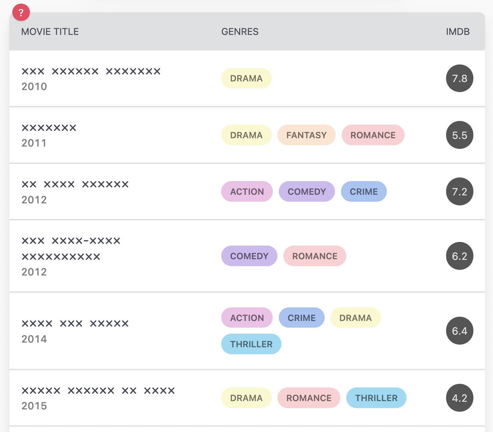
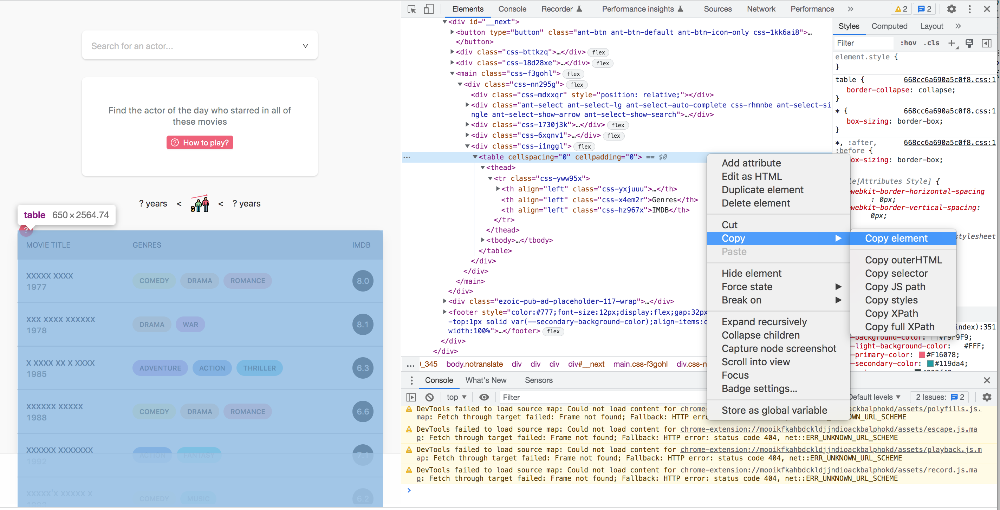

# KNACKTORLE

A command line application for solving [Actorle](https://actorle.com/), the daily actor guessing game. The origins and
design of this tool, and some details about the data it uses are discussed on
[Medium](https://medium.com/@michaeldfitzmaurice/solving-actorle-with-python-9f45d248e53f).

## Contents

- [What is Actorle?](#what-is-actorle)
- [What is Knacktorle?](#what-is-knacktorle)
- [Prerequisites](#prerequisites)
- [Installing](#installing)
- [Grabbing the IMDb data](#grabbing-the-imdb-data)
- [Running the Solver](#running-the-solver)
- [Offline Solving](#offline-solving)


## What is Actorle?
[Actorle](https://actorle.com/) is a daily puzzle where you guess the name of an actor from clues about a selection of
films they have appeared in. Each movie’s clue comprises the release year, the IMDb review score, the genres, and a 
pattern of X characters representing the title. You need to figure out enough of the movies to find the common element 
— an actor who appeared in all of them.

Inspired by the ubiquitous [Wordle](https://www.nytimes.com/games/wordle/index.html),
incorrect guesses bring you closer to the correct answer by revealing new information. In the case of Wordle, that new
information confirms or eliminates letters from the search space. In Actorle, an incorrect guess reveals whether the
actor you're looking for is older or younger than the one you've just guessed, and will also uncover the names of any
films amongst the clues where the target actor has appeared alongside that actor. It's a fun game for any movie buff.

<kbd></kbd>


## What is Knacktorle?
**Knacktorle** is an awkwardly-named command line tool for solving Actorle puzzles in a single guess. It solves puzzles
by searching against [local IMDb data files](#grabbing-the-imdb-data) read in at runtime.

See it in action:

[](https://asciinema.org/a/GHsSVZvksUcWLpoa1urkQxdez)


## Prerequisites
- Python 3.8.1 or greater (_probably_ works with other Python 3 versions, but `3.8.1` is the only one I've used with it)
  - On Apple silicon you will likely need Python 3.9 or greater; numpy probably won't `pip install` on earlier versions
- (Unless you want to use the solver only in [offline mode](#offline-solving)) A local web browser - I use Chrome - that
can be driven by [Selenium WebDriver](https://www.selenium.dev/documentation/webdriver/)
- About 900MB of disk space to be used when downloading and pre-processing the IMDb dataset (once
pre-processing is complete the data uses far less space, more like 22MB)


## Installing
Installing into a Python virtual environment is
[generally a good idea](https://towardsdatascience.com/why-you-should-use-a-virtual-environment-for-every-python-project-c17dab3b0fd0).
I highly recommend [PyEnv](https://github.com/pyenv/pyenv) for managing different Python versions and virtual
environments. Alternatively, you could go low tech and do something like:

```bash
 $ python3 -m venv venv
 $ source venv/bin/activate
 $ pip install -r requirements.txt
```

### The Selenium Web Driver
Unfortunately, we cannot just use a standard HTTP client like [`requests`](https://requests.readthedocs.io/en/latest/)
to grab the puzzle of the day from https://actorle.com/ and then parse the clues out of the page using something like
[Beautiful Soup](https://www.crummy.com/software/BeautifulSoup/). When you request that Actorle URL, what you get back
in the response entity body is a big ol' bunch o' JavaScript, some HTML, but no actual puzzle. See for yourself:
`curl -vk "https://actorle.com/"`. Something has to interpret that JavaScript in order to generate the puzzle HTML we
want to parse the clues out of.

Rather than trying to run a JS engine in Python, I opted to use the Python client library for
[Selenium WebDriver](https://www.selenium.dev/documentation/webdriver/) to programmatically control my
local web browser so that _it_ can grab the page, execute the JS that builds the HTML, and then give me programmatic
access to the generated HTML so that I can parse the clues from it.

Although this approach works nicely, it also makes the dependencies a bit non-deterministic. Ideally you should be able
to `pip install -r requirements.txt` into your env, and be able to run the app in exactly the same way I can on my
machine. If by some coincidence you happen to be using Chrome and at the exact same version as me, this _will_ be the
case, but that seems unlikely. If you are running Chrome, you will need to check your Chrome version (`Chrome` >
`About Google Chrome`) and `pip install` the matching `chromedriver-py` version - look
[here](https://pypi.org/project/chromedriver-py/#history) to find the version that matches your local Chrome.

If you're using a different browser, you will need to `pip install` the Python bindings for it, and possibly also the
underlying driver; see the instructions on the `selenium` package at [PyPI](https://pypi.org/project/selenium/).
You will also need to slightly tweak the code in `movie_clues.py` that is responsible for grabbing the clues for
today's puzzle. The relevant lines look like this for Chrome:

```python
service_object = Service(binary_path)
driver_options = Options()
driver_options.headless = True
driver = webdriver.Chrome(service=service_object, options=driver_options)
```
You should be able to replace them with the equivalent code for whatever non-Chrome driver you are using.


## Grabbing the IMDb data
For non-commercial hacking, IMDb provide a regularly updated [data dump](https://www.imdb.com/interfaces/) of a subset
of their database, in compressed TSV files. Knacktorle uses 4 of these files to solve puzzles.

The script `imdb_data_grabber.py` is a tool for downloading these files to a local directory and then filtering out
extraneous data (e.g. data about TV shows rather than movies, or camera operators rather than actors) to minimise the
file sizes. This filtering reduces the overall data size from `c.895MB` to `c.22MB`.

```bash
$ python imdb_data_grabber.py --output-dir data

Downloading IMDb data files to data directory
-----------------------------------
Looking for /Users/mickyfitz/workspace/knacktorle/data/title.basics.tsv.gz...
  /Users/mickyfitz/workspace/knacktorle/data/title.basics.tsv.gz Not found
  Downloaded https://datasets.imdbws.com/title.basics.tsv.gz
  Read in 9,621,894 rows - filtering out non-movies...
  Filtered down to 635,933 movie titles
  Removing unnecessary columns...
  Finished Removing unnecessary columns
  Writing filtered file to /Users/mickyfitz/workspace/knacktorle/data/title.basics.tsv.gz...
  Finished writing filtered file to /Users/mickyfitz/workspace/knacktorle/data/title.basics.tsv.gz
-----------------------------------
Looking for /Users/mickyfitz/workspace/knacktorle/data/title.principals.tsv.gz...
  /Users/mickyfitz/workspace/knacktorle/data/title.principals.tsv.gz Not found
  Downloaded https://datasets.imdbws.com/title.principals.tsv.gz
  Read in 54,685,074 rows - filtering out non-acting categories...
  Removed non-acting categories - we now have 21,415,544 rows
  Filtering out performances in non-movies using movies dataframe containing 635,933 movies
  Filtered down to 1,975,760 movie performances
  Removing unnecessary columns...
  Finished Removing unnecessary columns
  Writing filtered file to /Users/mickyfitz/workspace/knacktorle/data/title.principals.tsv.gz...
  Finished writing filtered file to /Users/mickyfitz/workspace/knacktorle/data/title.principals.tsv.gz
-----------------------------------
Looking for /Users/mickyfitz/workspace/knacktorle/data/name.basics.tsv.gz...
  /Users/mickyfitz/workspace/knacktorle/data/name.basics.tsv.gz Not found
  Downloaded https://datasets.imdbws.com/name.basics.tsv.gz
  Read in 12,310,517 rows - filtering out non-actors...
  Filtered down to 4,500,248 actors
  Filtering out people we don't have performances for, using dataframe containing 1,975,760 performances
  Filtered down to 640,396 actors
  Removing unnecessary columns...
  Finished Removing unnecessary columns
  Writing filtered file to /Users/mickyfitz/workspace/knacktorle/data/name.basics.tsv.gz...
  Finished writing filtered file to /Users/mickyfitz/workspace/knacktorle/data/name.basics.tsv.gz
```

```bash
$ ls -lh data

total 51344
-rw-r--r--@ 1 mickyfitz  staff   4.0M 22 Dec 21:29 name.basics.tsv.gz
-rw-r--r--@ 1 mickyfitz  staff   4.5M 22 Dec 21:28 title.basics.tsv.gz
-rw-r--r--@ 1 mickyfitz  staff    13M 22 Dec 21:29 title.principals.tsv.gz
-rw-r--r--@ 1 mickyfitz  staff   1.1M 22 Dec 21:28 title.ratings.tsv.gz
```

For convenience, this repo contains a `.gitignored` `data` directory for the purpose of holding these IMDb data files.
You can choose a different location if you want - just pass it as the `--output-dir` parameter when you run the
downloader. The directory you want to download to must already exist.

Please note the
[non-commercial licensing terms](https://help.imdb.com/article/imdb/general-information/can-i-use-imdb-data-in-my-software/G5JTRESSHJBBHTGX?pf_rd_m=A2FGELUUNOQJNL&pf_rd_p=de9c4790-0da4-42eb-81f4-eae1a2add3f4&pf_rd_r=RFAVX0MDYK6SVCRJBVNY&pf_rd_s=center-1&pf_rd_t=60601&pf_rd_i=interfaces&ref_=fea_mn_lk1#)
of the IMDb data.

**Data licencing information**: Information courtesy of IMDb(https://www.imdb.com). Used with permission.


## Running the Solver
The solver's CLI is fairly discoverable:

```shell
python actorle_solver.py --help
usage: actorle_solver.py [-h] -mf MOVIES_FILE -af ACTORS_FILE -pf PERFORMANCES_FILE [-cf CLUES_FILE] [-w WRITE_CLUES_FILE] [-n NUM_OPTIONS] [-r RATING_TOLERANCE]

Solve an Actorle puzzle. Today's puzzle will be retrieved from https://actorle.com/ and solved, unless a different puzzle is specified using the --clues-file argument.

options:
  -h, --help            show this help message and exit
  -mf MOVIES_FILE, --movies-file MOVIES_FILE
                        the full path to an IMDb title.basics.tsv.gz file, as modified by the
                        data grabber tool imdb_data_grabber.py using raw data downloaded from
                        https://datasets.imdbws.com.
                        Mandatory.
  -af ACTORS_FILE, --actors-file ACTORS_FILE
                        the full path to an IMDb name.basics.tsv.gz file, as found at https://datasets.imdbws.com.
                        Mandatory.
  -pf PERFORMANCES_FILE, --performances-file PERFORMANCES_FILE
                        the full path to an IMDb title.principals.tsv.gz file, as found at https://datasets.imdbws.com.
                        Mandatory.
  -cf CLUES_FILE, --clues-file CLUES_FILE
                        the full path to a puzzle file that contains the clues. Optional.
                        When this parameter is not set, today's puzzle will be retrieved from https://actorle.com/.
                        Each line in the file represents the clues for an individual movie and should look like:

                        <title pattern>|<year>|<genres>|<score>

                        For example:

                        xxx xxxxxxxxxxx|2002|Action,Crime,Thriller|7.1
  -w WRITE_CLUES_FILE, --write-clues-file WRITE_CLUES_FILE
                        the full path to write out a puzzle file that contains the clues. Optional.
                        This allows you to "save" puzzles to be used later/offline.
                        Each line in the file represents the clues for an individual movie and will look like:

                        <title pattern>|<year>|<genres>|<score>

                        For example:

                        xxx xxxxxxxxxxx|2002|Action,Crime,Thriller|7.1
  -n NUM_OPTIONS, --num-options NUM_OPTIONS
                        The number of potential answers to display. Optional, default is 3.
  -r RATING_TOLERANCE, --rating-tolerance RATING_TOLERANCE
                        The tolerance around movie review rating matching. Optional, default is 0.1,
                        meaning a clue with an IMDb score of 6.4 will match movies with scores from
                        6.3 to 6.5 inclusive. This mechanism exists because IMDb scores can change over
                        time as more people provide review scores.
```

To solve today's puzzle, assuming you downloaded the IMDb data to the `data` directory:

```bash
$ python actorle_solver.py \
--movies-file data/title.basics.tsv.gz \
--performances-file data/title.principals.tsv.gz \
--actors-file data/name.basics.tsv.gz
```

The console output looks like this:

```
No clues file supplied; solving today's puzzle from https://actorle.com/
Requesting https://actorle.com/ via selenium
Retrieved a web page with the title 'Actorle | the actor guessing game'
Found 30 clues for the puzzle from 2023-01-05:
[MovieClue(title_pattern='xxxxx',
           year='1991',
           genre_list='Drama,Romance',
           score=7.2),
 MovieClue(title_pattern='xxx xxxxx xxx xxx xxxx',
           year='1995',
           genre_list='Western,Action,Thriller',
           score=6.5),
 MovieClue(title_pattern='xxxxxxxxxx',
           year='1995',
           genre_list='Action,Crime,Science Fiction,Thriller',
           score=5.5),
 MovieClue(title_pattern='x.x. xxxxxxxxxxxx',
           year='1997',
           genre_list='Crime,Mystery,Thriller',
           score=8.2),
 MovieClue(title_pattern='xxxxxxx, xxxxxx',
           year='1999',
           genre_list='Drama,Comedy',
           score=6.7),
 MovieClue(title_pattern='xxx xxxxxxx',
           year='1999',
           genre_list='Drama,Thriller',
           score=7.8),
 MovieClue(title_pattern='xxxxxxxxx',
           year='2000',
           genre_list='Action,Drama,Adventure',
           score=8.5),
 MovieClue(title_pattern='x xxxxxxxxx xxxx',
           year='2001',
           genre_list='Drama,Romance',
           score=8.2),
 MovieClue(title_pattern='xxxxxx xxx xxxxxxxxx: xxx xxx xxxx xx xxx xxxxx',
           year='2003',
           genre_list='Adventure,Drama,War',
           score=7.4),
 MovieClue(title_pattern='xxxxxxxxxx xxx',
           year='2005',
           genre_list='Romance,Drama,History',
           score=8.0),
 MovieClue(title_pattern='x xxxx xxxx',
           year='2006',
           genre_list='Comedy,Drama,Romance',
           score=6.9),
 MovieClue(title_pattern='x:xx xx xxxx',
           year='2007',
           genre_list='Western',
           score=7.7),
 MovieClue(title_pattern='xxxxxxxx xxxxxxxx',
           year='2007',
           genre_list='Drama,Crime',
           score=7.8),
 MovieClue(title_pattern='xxxx xx xxxx',
           year='2008',
           genre_list='Action,Drama,Thriller',
           score=7.0),
 MovieClue(title_pattern='xxxxx xx xxxx',
           year='2009',
           genre_list='Thriller,Drama,Mystery',
           score=7.1),
 MovieClue(title_pattern='xxxxx xxxx',
           year='2010',
           genre_list='Action,Adventure,Drama',
           score=6.6),
 MovieClue(title_pattern='xxx xxxx xxxxx xxxx',
           year='2010',
           genre_list='Romance,Drama,Thriller,Crime',
           score=7.3),
 MovieClue(title_pattern='xxx xxx xxxx xxx xxxx xxxxx',
           year='2012',
           genre_list='Action',
           score=5.4),
 MovieClue(title_pattern='xxx xxxxxxxxxx',
           year='2012',
           genre_list='History,Drama,Music',
           score=7.5),
 MovieClue(title_pattern='xxxxxx xxxx',
           year='2013',
           genre_list='Thriller,Crime,Drama',
           score=6.1),
 MovieClue(title_pattern='xxx xx xxxxx',
           year='2013',
           genre_list='Action,Adventure,Science Fiction',
           score=7.1),
 MovieClue(title_pattern="xxxxxx'x xxxx",
           year='2014',
           genre_list='Drama,Fantasy,Mystery,Romance',
           score=6.1),
 MovieClue(title_pattern='xxxx',
           year='2014',
           genre_list='Drama,Adventure',
           score=5.8),
 MovieClue(title_pattern='xxx xxxxx xxxxxxx',
           year='2014',
           genre_list='War,Drama',
           score=7.0),
 MovieClue(title_pattern='xxx xxxx xxxx',
           year='2016',
           genre_list='Comedy,Crime,Action',
           score=7.3),
 MovieClue(title_pattern='xxx xxxxx',
           year='2017',
           genre_list='Fantasy,Thriller,Action,Adventure,Horror',
           score=5.4),
 MovieClue(title_pattern='xxx xxxxxx',
           year='2018',
           genre_list='Drama',
           score=6.9),
 MovieClue(title_pattern='xxxxxxxx',
           year='2020',
           genre_list='Action,Thriller',
           score=6.0),
 MovieClue(title_pattern="xxxx xxxxxx'x xxxxxxx xxxxxx",
           year='2021',
           genre_list='Action,Adventure,Fantasy,Science Fiction',
           score=8.0),
 MovieClue(title_pattern='xxxx: xxxx xxx xxxxxxx',
           year='2022',
           genre_list='Fantasy,Action,Comedy',
           score=6.3)]
Reading IMDb movie data from data/title.basics.tsv.gz
Reading movies in from data/title.basics.tsv.gz...
Read in 301,541 titles
Filtering out movies NOT from the years {'1991', '1995', '1997', '2020', '2000', '2006', '2008', '2009', '2018', '2003', '2016', '2022', '2021', '1999', '2012', '2001', '2014', '2005', '2013', '2017', '2010', '2007'}...
Filtered down to 141,184 movie titles
Reading IMDb actor performances data from data/title.principals.tsv.gz
Read in data on 1,136,243 performances
Filtering out performances NOT in one of the 141,184 candidate movies...
Filtered down to 484,832 performances

Working through the clues...
----------------------------
Looking for movie matches for MovieClue(title_pattern='xxxxx', year='1991', genre_list='Drama,Romance', score=7.2)
Found 117 movies from the year 1991 with review score close to 7.2
Filtering remaining movies with query 'primaryTitle.str.match('\w{5}$')'
5 Matches for pattern 'xxxxx', year 1991, review score 7.2 (Sample: ['Neria', 'Proof', 'Geniy'])
Found 20 actors for these 5 movies
----------------------------
Looking for movie matches for MovieClue(title_pattern='xxx xxxxx xxx xxx xxxx', year='1995', genre_list='Western,Action,Thriller', score=6.5)
Found 241 movies from the year 1995 with review score close to 6.5
Filtering remaining movies with query 'primaryTitle.str.match('\w{3} \w{5} \w{3} \w{3} \w{4}$')'
1 Matches for pattern 'xxx xxxxx xxx xxx xxxx', year 1995, review score 6.5 (Sample: ['The Quick and the Dead'])
Found 4 actors for these 1 movies
----------------------------
Looking for movie matches for MovieClue(title_pattern='xxxxxxxxxx', year='1995', genre_list='Action,Crime,Science Fiction,Thriller', score=5.5)
Found 182 movies from the year 1995 with review score close to 5.5
Filtering remaining movies with query 'primaryTitle.str.match('\w{10}$')'
4 Matches for pattern 'xxxxxxxxxx', year 1995, review score 5.5 (Sample: ['Peterscott', 'Rollerboys', 'Virtuosity'])
Found 19 actors for these 4 movies
----------------------------
Looking for movie matches for MovieClue(title_pattern='x.x. xxxxxxxxxxxx', year='1997', genre_list='Crime,Mystery,Thriller', score=8.2)
Found 63 movies from the year 1997 with review score close to 8.2
Filtering remaining movies with query 'primaryTitle.str.match('\w{1}\.\w{1}\. \w{12}$')'
1 Matches for pattern 'x.x. xxxxxxxxxxxx', year 1997, review score 8.2 (Sample: ['L.A. Confidential'])
Found 4 actors for these 1 movies
----------------------------
Looking for movie matches for MovieClue(title_pattern='xxxxxxx, xxxxxx', year='1999', genre_list='Drama,Comedy', score=6.7)
Found 201 movies from the year 1999 with review score close to 6.7
Filtering remaining movies with query 'primaryTitle.str.match('\w{7}\, \w{6}$')'
1 Matches for pattern 'xxxxxxx, xxxxxx', year 1999, review score 6.7 (Sample: ['Mystery, Alaska'])
Found 4 actors for these 1 movies
----------------------------
Looking for movie matches for MovieClue(title_pattern='xxx xxxxxxx', year='1999', genre_list='Drama,Thriller', score=7.8)
Found 78 movies from the year 1999 with review score close to 7.8
Filtering remaining movies with query 'primaryTitle.str.match('\w{3} \w{7}$')'
1 Matches for pattern 'xxx xxxxxxx', year 1999, review score 7.8 (Sample: ['The Insider'])
Found 4 actors for these 1 movies
----------------------------
Looking for movie matches for MovieClue(title_pattern='xxxxxxxxx', year='2000', genre_list='Action,Drama,Adventure', score=8.5)
Found 45 movies from the year 2000 with review score close to 8.5
Filtering remaining movies with query 'primaryTitle.str.match('\w{9}$')'
2 Matches for pattern 'xxxxxxxxx', year 2000, review score 8.5 (Sample: ['Gladiator', 'Solipsism'])
Found 4 actors for these 2 movies
----------------------------
Looking for movie matches for MovieClue(title_pattern='x xxxxxxxxx xxxx', year='2001', genre_list='Drama,Romance', score=8.2)
Found 58 movies from the year 2001 with review score close to 8.2
Filtering remaining movies with query 'primaryTitle.str.match('\w{1} \w{9} \w{4}$')'
1 Matches for pattern 'x xxxxxxxxx xxxx', year 2001, review score 8.2 (Sample: ['A Beautiful Mind'])
Found 4 actors for these 1 movies
----------------------------
Looking for movie matches for MovieClue(title_pattern='xxxxxx xxx xxxxxxxxx: xxx xxx xxxx xx xxx xxxxx', year='2003', genre_list='Adventure,Drama,War', score=7.4)
Found 166 movies from the year 2003 with review score close to 7.4
Filtering remaining movies with query 'primaryTitle.str.match('\w{6} \w{3} \w{9}\: \w{3} \w{3} \w{4} \w{2} \w{3} \w{5}$')'
1 Matches for pattern 'xxxxxx xxx xxxxxxxxx: xxx xxx xxxx xx xxx xxxxx', year 2003, review score 7.4 (Sample: ['Master and Commander: The Far Side of the World'])
Found 4 actors for these 1 movies
----------------------------
Looking for movie matches for MovieClue(title_pattern='xxxxxxxxxx xxx', year='2005', genre_list='Romance,Drama,History', score=8.0)
Found 157 movies from the year 2005 with review score close to 8.0
Filtering remaining movies with query 'primaryTitle.str.match('\w{10} \w{3}$')'
1 Matches for pattern 'xxxxxxxxxx xxx', year 2005, review score 8.0 (Sample: ['Cinderella Man'])
Found 4 actors for these 1 movies
----------------------------
Looking for movie matches for MovieClue(title_pattern='x xxxx xxxx', year='2006', genre_list='Comedy,Drama,Romance', score=6.9)
Found 280 movies from the year 2006 with review score close to 6.9
Filtering remaining movies with query 'primaryTitle.str.match('\w{1} \w{4} \w{4}$')'
1 Matches for pattern 'x xxxx xxxx', year 2006, review score 6.9 (Sample: ['A Good Year'])
Found 4 actors for these 1 movies
----------------------------
Looking for movie matches for MovieClue(title_pattern='x:xx xx xxxx', year='2007', genre_list='Western', score=7.7)
Found 197 movies from the year 2007 with review score close to 7.7
Filtering remaining movies with query 'primaryTitle.str.match('\w{1}\:\w{2} \w{2} \w{4}$')'
1 Matches for pattern 'x:xx xx xxxx', year 2007, review score 7.7 (Sample: ['3:10 to Yuma'])
Found 4 actors for these 1 movies
----------------------------
Looking for movie matches for MovieClue(title_pattern='xxxxxxxx xxxxxxxx', year='2007', genre_list='Drama,Crime', score=7.8)
Found 197 movies from the year 2007 with review score close to 7.8
Filtering remaining movies with query 'primaryTitle.str.match('\w{8} \w{8}$')'
1 Matches for pattern 'xxxxxxxx xxxxxxxx', year 2007, review score 7.8 (Sample: ['American Gangster'])
Found 4 actors for these 1 movies
----------------------------
Looking for movie matches for MovieClue(title_pattern='xxxx xx xxxx', year='2008', genre_list='Action,Drama,Thriller', score=7.0)
Found 539 movies from the year 2008 with review score close to 7.0
Filtering remaining movies with query 'primaryTitle.str.match('\w{4} \w{2} \w{4}$')'
1 Matches for pattern 'xxxx xx xxxx', year 2008, review score 7.0 (Sample: ['Body of Lies'])
Found 4 actors for these 1 movies
----------------------------
Looking for movie matches for MovieClue(title_pattern='xxxxx xx xxxx', year='2009', genre_list='Thriller,Drama,Mystery', score=7.1)
Found 403 movies from the year 2009 with review score close to 7.1
Filtering remaining movies with query 'primaryTitle.str.match('\w{5} \w{2} \w{4}$')'
1 Matches for pattern 'xxxxx xx xxxx', year 2009, review score 7.1 (Sample: ['State of Play'])
Found 4 actors for these 1 movies
----------------------------
Looking for movie matches for MovieClue(title_pattern='xxxxx xxxx', year='2010', genre_list='Action,Adventure,Drama', score=6.6)
Found 426 movies from the year 2010 with review score close to 6.6
Filtering remaining movies with query 'primaryTitle.str.match('\w{5} \w{4}$')'
7 Matches for pattern 'xxxxx xxxx', year 2010, review score 6.6 (Sample: ['White Lion', 'Robin Hood', 'Tough Luck'])
Found 29 actors for these 7 movies
----------------------------
Looking for movie matches for MovieClue(title_pattern='xxx xxxx xxxxx xxxx', year='2010', genre_list='Romance,Drama,Thriller,Crime', score=7.3)
Found 390 movies from the year 2010 with review score close to 7.3
Filtering remaining movies with query 'primaryTitle.str.match('\w{3} \w{4} \w{5} \w{4}$')'
1 Matches for pattern 'xxx xxxx xxxxx xxxx', year 2010, review score 7.3 (Sample: ['The Next Three Days'])
Found 4 actors for these 1 movies
----------------------------
Looking for movie matches for MovieClue(title_pattern='xxx xxx xxxx xxx xxxx xxxxx', year='2012', genre_list='Action', score=5.4)
Found 345 movies from the year 2012 with review score close to 5.4
Filtering remaining movies with query 'primaryTitle.str.match('\w{3} \w{3} \w{4} \w{3} \w{4} \w{5}$')'
1 Matches for pattern 'xxx xxx xxxx xxx xxxx xxxxx', year 2012, review score 5.4 (Sample: ['The Man with the Iron Fists'])
Found 4 actors for these 1 movies
----------------------------
Looking for movie matches for MovieClue(title_pattern='xxx xxxxxxxxxx', year='2012', genre_list='History,Drama,Music', score=7.5)
Found 550 movies from the year 2012 with review score close to 7.5
Filtering remaining movies with query 'primaryTitle.str.match('\w{3} \w{10}$')'
4 Matches for pattern 'xxx xxxxxxxxxx', year 2012, review score 7.5 (Sample: ['The Deposition', 'The Impossible', 'Les Misérables'])
Found 10 actors for these 4 movies
----------------------------
Looking for movie matches for MovieClue(title_pattern='xxxxxx xxxx', year='2013', genre_list='Thriller,Crime,Drama', score=6.1)
Found 449 movies from the year 2013 with review score close to 6.1
Filtering remaining movies with query 'primaryTitle.str.match('\w{6} \w{4}$')'
5 Matches for pattern 'xxxxxx xxxx', year 2013, review score 6.1 (Sample: ['Crying Wolf', 'Inside Waco', 'Broken City'])
Found 20 actors for these 5 movies
----------------------------
Looking for movie matches for MovieClue(title_pattern='xxx xx xxxxx', year='2013', genre_list='Action,Adventure,Science Fiction', score=7.1)
Found 504 movies from the year 2013 with review score close to 7.1
Filtering remaining movies with query 'primaryTitle.str.match('\w{3} \w{2} \w{5}$')'
2 Matches for pattern 'xxx xx xxxxx', year 2013, review score 7.1 (Sample: ['Man of Steel', 'Out of Print'])
Found 4 actors for these 2 movies
----------------------------
Looking for movie matches for MovieClue(title_pattern="xxxxxx'x xxxx", year='2014', genre_list='Drama,Fantasy,Mystery,Romance', score=6.1)
Found 439 movies from the year 2014 with review score close to 6.1
Filtering remaining movies with query 'primaryTitle.str.match('\w{6}\'\w{1} \w{4}$')'
1 Matches for pattern 'xxxxxx'x xxxx', year 2014, review score 6.1 (Sample: ["Winter's Tale"])
Found 4 actors for these 1 movies
----------------------------
Looking for movie matches for MovieClue(title_pattern='xxxx', year='2014', genre_list='Drama,Adventure', score=5.8)
Found 424 movies from the year 2014 with review score close to 5.8
Filtering remaining movies with query 'primaryTitle.str.match('\w{4}$')'
10 Matches for pattern 'xxxx', year 2014, review score 5.8 (Sample: ['Ride', 'Haru', 'Hits'])
Found 44 actors for these 10 movies
----------------------------
Looking for movie matches for MovieClue(title_pattern='xxx xxxxx xxxxxxx', year='2014', genre_list='War,Drama', score=7.0)
Found 740 movies from the year 2014 with review score close to 7.0
Filtering remaining movies with query 'primaryTitle.str.match('\w{3} \w{5} \w{7}$')'
1 Matches for pattern 'xxx xxxxx xxxxxxx', year 2014, review score 7.0 (Sample: ['The Water Diviner'])
Found 4 actors for these 1 movies
----------------------------
Looking for movie matches for MovieClue(title_pattern='xxx xxxx xxxx', year='2016', genre_list='Comedy,Crime,Action', score=7.3)
Found 523 movies from the year 2016 with review score close to 7.3
Filtering remaining movies with query 'primaryTitle.str.match('\w{3} \w{4} \w{4}$')'
2 Matches for pattern 'xxx xxxx xxxx', year 2016, review score 7.3 (Sample: ['The Hurt Game', 'The Dark Days'])
Found 4 actors for these 2 movies
----------------------------
Looking for movie matches for MovieClue(title_pattern='xxx xxxxx', year='2017', genre_list='Fantasy,Thriller,Action,Adventure,Horror', score=5.4)
Found 409 movies from the year 2017 with review score close to 5.4
Filtering remaining movies with query 'primaryTitle.str.match('\w{3} \w{5}$')'
5 Matches for pattern 'xxx xxxxx', year 2017, review score 5.4 (Sample: ['The Stray', 'The Lears', 'The Comet'])
Found 20 actors for these 5 movies
----------------------------
Looking for movie matches for MovieClue(title_pattern='xxx xxxxxx', year='2018', genre_list='Drama', score=6.9)
Found 574 movies from the year 2018 with review score close to 6.9
Filtering remaining movies with query 'primaryTitle.str.match('\w{3} \w{6}$')'
4 Matches for pattern 'xxx xxxxxx', year 2018, review score 6.9 (Sample: ['The Return', 'The Answer', 'The Eulogy'])
Found 14 actors for these 4 movies
----------------------------
Looking for movie matches for MovieClue(title_pattern='xxxxxxxx', year='2020', genre_list='Action,Thriller', score=6.0)
Found 595 movies from the year 2020 with review score close to 6.0
Filtering remaining movies with query 'primaryTitle.str.match('\w{8}$')'
20 Matches for pattern 'xxxxxxxx', year 2020, review score 6.0 (Sample: ['Intruder', 'Feedback', 'Arkansas'])
Found 81 actors for these 20 movies
----------------------------
Looking for movie matches for MovieClue(title_pattern="xxxx xxxxxx'x xxxxxxx xxxxxx", year='2021', genre_list='Action,Adventure,Fantasy,Science Fiction', score=8.0)
Found 367 movies from the year 2021 with review score close to 8.0
Filtering remaining movies with query 'primaryTitle.str.match('\w{4} \w{6}\'\w{1} \w{7} \w{6}$')'
1 Matches for pattern 'xxxx xxxxxx'x xxxxxxx xxxxxx', year 2021, review score 8.0 (Sample: ["Zack Snyder's Justice League"])
Found 4 actors for these 1 movies
----------------------------
Looking for movie matches for MovieClue(title_pattern='xxxx: xxxx xxx xxxxxxx', year='2022', genre_list='Fantasy,Action,Comedy', score=6.3)
Found 524 movies from the year 2022 with review score close to 6.3
Filtering remaining movies with query 'primaryTitle.str.match('\w{4}\: \w{4} \w{3} \w{7}$')'
1 Matches for pattern 'xxxx: xxxx xxx xxxxxxx', year 2022, review score 6.3 (Sample: ['Thor: Love and Thunder'])
Found 4 actors for these 1 movies
----------------------------
Made a list of 341 individual movie performances from all the clues


Actor IDs occurring most often across all possible candidate movies:[('nm0000128', 26), ('nm0000124', 3), ('nm0000138', 2)]
Converting actor IDs to names using data/name.basics.tsv.gz

Dude - I think it's... Russell Crowe!
Here are some Russell Crowe film roles from movies that match clues:

                                              Movie  Year              Character
0                                             Proof  1991               ["Andy"]
1                            The Quick and the Dead  1995               ["Cort"]
2                                        Virtuosity  1995            ["SID 6.7"]
3                                 L.A. Confidential  1997          ["Bud White"]
4                                   Mystery, Alaska  1999         ["John Biebe"]
5                                       The Insider  1999     ["Jeffrey Wigand"]
6                                         Gladiator  2000            ["Maximus"]
7                                     Proof of Life  2000       ["Terry Thorne"]
8                                  A Beautiful Mind  2001          ["John Nash"]
9   Master and Commander: The Far Side of the World  2003  ["Capt. Jack Aubrey"]
10                                   Cinderella Man  2005       ["Jim Braddock"]
11                                      A Good Year  2006        ["Max Skinner"]
12                                     3:10 to Yuma  2007           ["Ben Wade"]
13                                American Gangster  2007     ["Richie Roberts"]
14                                     Body of Lies  2008         ["Ed Hoffman"]
15                                       Tenderness  2009    ["Lt. Cristofuoro"]
16                                    State of Play  2009       ["Cal McAffrey"]
17                                       Robin Hood  2010   ["Robin Longstride"]
18                              The Next Three Days  2010       ["John Brennan"]
19                      The Man with the Iron Fists  2012         ["Jack Knife"]
20                                   Les Misérables  2012             ["Javert"]
21                                      Broken City  2013    ["Mayor Hostetler"]
22                                    Winter's Tale  2014      ["Pearly Soames"]
23                                             Noah  2014               ["Noah"]
24                                The Water Diviner  2014             ["Connor"]
25                                    The Nice Guys  2016      ["Jackson Healy"]
26                                        The Mummy  2017       ["Henry Jekyll"]
27                                       Boy Erased  2018    ["Marshall Eamons"]
28                                         Unhinged  2020                ["Man"]
29                                       Poker Face  2022         ["Jake Foley"]

Options
----------------
1) Russell Crowe is 83.87% likely
2) Jennifer Connelly is 9.68% likely
3) Leonardo DiCaprio is 6.45% likely

```

It should take around 2 to 6 seconds to solve a daily puzzle, depending on how many clues the puzzle
contains, how the HTTP conversation with the Actorle web server goes, how powerful your machine is, etc. Solving from
a local clues file is quicker - generally around 1.5 seconds on my local machine.


## Offline Solving
By default, Knacktorle will grab today's Actorle puzzle from over the web and solve it. However, the solver can also be
used in an offline mode where the puzzle to solve is read in from a local [`clues file`](#clues-file-format), rather
than from the web. A number of such files can be found in the `clues-files` directory.

To solve a puzzle in offline mode, pass the path to the clues file you want to use via the `--clues-file` parameter:

```bash
python actorle_solver.py \
--movies-file data/title.basics.tsv.gz \
--performances-file data/title.principals.tsv.gz \
--actors-file data/name.basics.tsv.gz \
--clues-file clues-files/actorle-2022-06-18.txt
```

### Clues File Format
Clues files use a simple proprietary, pipe-separated format:

```bash
<movie title pattern>|<movie release year>|<movie genre list>|<IMDb review score>
```

On reflection, a standard format like YAML or JSON would probably have been a better choice, but there you go. You
can see examples of clues files for previous Actorle puzzles in the `clues-files` directory:

```bash
$ cat clues-files/actorle-2022-06-18.txt

xxx xxxxxxx xxx|2002|Adventure,Action,Thriller|6.1
xxx xxxxxxxxx|2004|Drama,Romance|6.3
xxxxx & xxxxxxxxx|2005|Drama,Romance|7.8
xxxx|2005|Action,Horror,Science Fiction|5.2
xxxxxxxx|2007|Thriller|7.2
xxxxxxxxxx|2009|Science Fiction,Action,Thriller|6.3
xx xxxxxxxxx|2009|Drama,Romance|7.3
xxxx xx xxxxxxxx|2010|Comedy,Drama,History|7.1
xxxxxx'x xxxxxxx|2010|Comedy,Drama|7.3
xxxxxx xxxxxxx xxxxxx|2011|Crime,Adventure,Action,Comedy,Thriller|6.3
xxx xxx xxxx|2011|Comedy|6.2
xxxxx xx xxx xxxxxx|2012|Fantasy,Adventure|5.7
xxxx xxxxxxx|2012|Crime,Drama,Thriller,Action|7.0
xxx xxxxx'x xxx|2013|Comedy,Action,Science Fiction|6.9
x xxxx xxx xxxx|2014|Comedy,Drama|6.3
xxxx xxxx|2014|Mystery,Thriller,Drama|8.1
x xxxxxx xxxxxxx|2016|Drama,History|6.8
xxxxxxxx|2017|Western,Drama,History|7.2
x xxxx xx xxxxxxx|2018|Thriller,Drama,Crime|5.8
```

Formatted for clarity:

```bash
$ cat clues-files/actorle-2022-06-18.txt | column -ts '|'

xxx xxxxxxx xxx        2002  Adventure,Action,Thriller               6.1
xxx xxxxxxxxx          2004  Drama,Romance                           6.3
xxxxx & xxxxxxxxx      2005  Drama,Romance                           7.8
xxxx                   2005  Action,Horror,Science Fiction           5.2
xxxxxxxx               2007  Thriller                                7.2
xxxxxxxxxx             2009  Science Fiction,Action,Thriller         6.3
xx xxxxxxxxx           2009  Drama,Romance                           7.3
xxxx xx xxxxxxxx       2010  Comedy,Drama,History                    7.1
xxxxxx'x xxxxxxx       2010  Comedy,Drama                            7.3
xxxxxx xxxxxxx xxxxxx  2011  Crime,Adventure,Action,Comedy,Thriller  6.3
xxx xxx xxxx           2011  Comedy                                  6.2
xxxxx xx xxx xxxxxx    2012  Fantasy,Adventure                       5.7
xxxx xxxxxxx           2012  Crime,Drama,Thriller,Action             7.0
xxx xxxxx'x xxx        2013  Comedy,Action,Science Fiction           6.9
x xxxx xxx xxxx        2014  Comedy,Drama                            6.3
xxxx xxxx              2014  Mystery,Thriller,Drama                  8.1
x xxxxxx xxxxxxx       2016  Drama,History                           6.8
xxxxxxxx               2017  Western,Drama,History                   7.2
x xxxx xx xxxxxxx      2018  Thriller,Drama,Crime                    5.8
```

### Creating Clues Files
There is nothing to stop you from manually creating clues files, but that is very tedious. There are a couple of ways
to automate the process:

#### 1 - Persisting today's clues
Use the `--write-clues-file` parameter when solving today's puzzle to persist the clues to a local file for later use:
```bash
python actorle_solver.py \
--movies-file data/title.basics.tsv.gz \
--performances-file data/title.principals.tsv.gz \
--actors-file data/name.basics.tsv.gz \
--write-clues-file /some/path/actorle-YYYY-MM-DD.txt
```

#### 2 - Janky semi-automated process for achived puzzles
Actorle provides an [archive](https://actorle.com/archive/) of previous puzzles, so you can play them at any time once
they've been the daily puzzle at some point. It would be nice to have the solver take an optional date parameter and go
and fetch the corresponding archived puzzle to solve, but I've not built that yet.

In the meantime, you can turn archived puzzles (or even the current daily puzzle) into clues files in a hacky
semi-automated way by browsing to the archive puzzle you want at https://actorle.com/archive/, inspecting the page,
then copy/pasting the `<table>` tag in the HTML into a text file.

<kbd></kbd>

You can then transform the HTML fragments in that file into a clues file using the `tools/actorle_file_transformer.py`
script, which takes the path to the file as its single argument and modifies the file in place:

```bash
PYTHONPATH=$PYTHONPATH. python tools/actorle_file_transformer.py clues-files/actorle-2022-12-15.txt

Tranforming the raw actorle file at clues-files/actorle-2022-12-15.txt

The transformed content looks like:
'xxx xx xxxx|1989|Crime,Drama,Romance,Mystery,Thriller|6.8
xxxxxx|1989|Fantasy,Romance,Drama|6.4
xxx xxxxxxxxxxx|1994|Fantasy,Comedy,Family|5.0
xxx xxx xxxxxxxx|1998|Comedy,Crime|8.1
xxxxxx xxxx|2000|Comedy,Drama,Music,Romance|5.7
x xxxxxxx, xxxxx xxx xxxx?|2000|Adventure,Comedy,Crime|7.7
xxx xxxxxxx'x xxx xxxxxx|2000|Adventure,Animation,Comedy,Family,Fantasy|7.4
xxxxxxxx, xxx.|2001|Animation,Comedy,Family|8.1
xxx xxxxxx xxxx x|2003|Family,Animation,Adventure|5.3
xxxx|2006|Animation,Adventure,Comedy,Family|7.2
xxxx xxxxxxxx|2007|Fantasy,Comedy,Family|5.4
xxx xxxxx|2007|Family,Animation,Adventure,Comedy|6.1
xxxxx xxxxx|2008|Family,Action,Adventure,Comedy|6.0
xxxxxxxxxxx xx x xxxxxxxxxx|2009|Comedy,Romance|5.8
xxx xxxxxxxx xxx xxx xxxx|2009|Romance,Family,Animation|7.1
xxx xxxxxx|2011|Drama,Comedy,Romance|7.9
xxxxxxxxx xxxx & xxxxxxxxxx xxxxx|2011|Drama|6.9
xxxx|2012|Drama,Thriller|7.7
xxxxxxxxxx|2012|Family,Animation,Adventure,Comedy|7.0
xxx xxxxxxxx|2012|Comedy|6.1
xxxxxx|2012|Drama|7.3
xxx xxxxxxxx xxxx xxx|2013|Comedy|5.8
xxxxxxxx xxxxxxxxxx|2013|Animation,Family|7.2
xxx xxxxxxxxx xxx|2014|War,Drama,History,Action|6.1
xxxxxxxxxxxx: xxx xx xxxxxxxxxx|2014|Science Fiction,Action,Adventure|5.6
xx xxxxxxxxxxx xxxx|2016|Thriller,Science Fiction,Drama,Horror|7.2
xxxx: xxxxx xxxxxx|2017|Action,Adventure,Fantasy|6.6
xxxxxxxxxxxx: xxx xxxx xxxxxx|2017|Action,Adventure,Science Fiction|5.2
xxxxxxxx xxx xxx xxxx xx x xxxxxxxx xxxxxxx|2017|Adventure,Science Fiction,Action|6.4
xxxxxx xxxxxx|2017|Action,Thriller|6.7'

Transformed the raw actorle file at clues-files/actorle-2022-dec-15.txt
```


