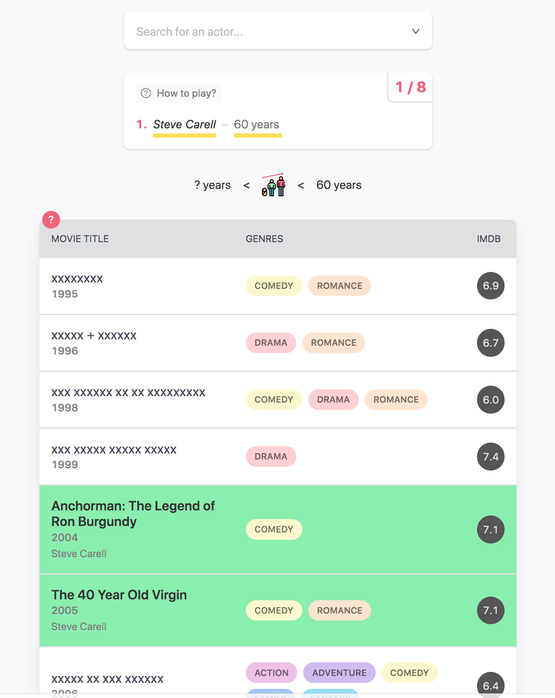

# KNACKTORLE

A CLI-based solver for [Actorle](https://actorle.com/), the daily actor guessing game.

## Contents

- [Introduction](#introduction)
- [Prerequisites](#prerequisites)
- [Installing](#installing)
  - [The Selenium WebDriver](#the-selenium-web-driver)
- [Getting the IMDb data](#geting-the-imdb-data)
- [Running the Solver](#running-the-solver)
  - [Offline Solving](#offline-solving)


## Introduction
[Actorle](https://actorle.com/) is a daily puzzle where you guess the name of an actor from clues about a selection of
films they have appeared in. Inspired by the ubiquitous Wordle, incorrect guesses bring you closer to the correct answer
by revealing new information. In the case of [Wordle](https://www.nytimes.com/games/wordle/index.html), that new
information confirms or eliminates letters from the search space; in Actorle an incorrect guess reveals whether the
actor you're looking for is older or younger than the one you've just guessed, and will also uncover the names of any
films the target actor has appeared in alongside that actor. It's a fun game for any movie buff.

<kbd></kbd>

Knacktorle is an awkwardly-named command line tool for solving Actorle puzzles. It searches
[local IMDb data files](#geting-the-imdb-data) read in at runtime:

[](https://asciinema.org/a/549538)


## Prerequisites
- Python 3.8.1 or greater (_probably_ works with other Python 3 versions, but `3.8.1` is the only one I've used with it)
- A local web browser (I use Chrome) that can be driven by [Selenium WebDriver](https://www.selenium.dev/documentation/webdriver/)
- At least 600 MBs of disk space for the IMDb data files


## Installing
Using a Python virtual environment is
[generally a good idea](https://towardsdatascience.com/why-you-should-use-a-virtual-environment-for-every-python-project-c17dab3b0fd0).
I highly recommend [PyEnv](https://github.com/pyenv/pyenv) for managing Python virtual environments, or you could go
low tech and do something like:

```bash
 $ python3 -m venv venv
 $ source venv/bin/activate
 $ pip install -r requirements.txt
```

### The Selenium Web Driver
Unfortunately, we cannot just use a standard HTTP client like [`requests`](https://requests.readthedocs.io/en/latest/)
to grab the puzzle of the day from https://actorle.com/ and then parse the clues out of the page using something like
[Beautiful Soup](https://www.crummy.com/software/BeautifulSoup/). When you request that Actorle URL, all you get back
in the response entity body is a big ol' bunch o' JavaScript - see for yourself: `curl -vk "https://actorle.com/"`.
Something has to interpret that JavaScript in order to generate the HTML we want to parse the clues out of.

Rather than trying to run a JS engine in Python, I opted to use the Python client library for
[Selenium WebDriver](https://www.selenium.dev/documentation/webdriver/) to programmatically control my
local web browser so that _it_ can grab the page, execute the JS that builds the HTML, and then give me programmatic
access to the generated HTML so that I can parse the clues from it.

Although this approach works nicely, it also makes the dependencies a bit non-deterministic. Ideally you should be able
to `pip install  -r requirements.txt` into your env, and be able to run the app in exactly the same way I can on my
machine. If by some coincidence you happen to be using Chrome and at the exact same version as me, this _will_ be the
case, but that seems unlikely. If you are running Chrome, you will need to check your Chrome version (`Chrome` >
`About Google Chrome`) and `pip install` the matching `chromedriver-py` version - look
[here](https://pypi.org/project/chromedriver-py/) to find the version that matches your local Chrome. 

If you're using a different browser, you will need to `pip install` the Python bindings for it, and possibly also the
underlying driver; see the instructions on the [`selenium` package](https://pypi.org/project/selenium/) page at PyPI.
You will also need to slightly tweak the code in `actorle_solver.py` that is responsible for grabbing the clues for
today's puzzle. The relevant lines look like this for Chrome:

```python
    service_object = Service(binary_path)
    driver_options = Options()
    driver_options.headless = True
    driver = webdriver.Chrome(service=service_object, options=driver_options)
```
You should be able to replace them with the equivalent code for whatever non-Chrome driver you are using.


## Geting the IMDb data
IMDb provide something for non-commercial hacking - a regularly updated data dump of a subset of their database, in
compressed TSV files.


## Running the Solver

### Offline Solving
